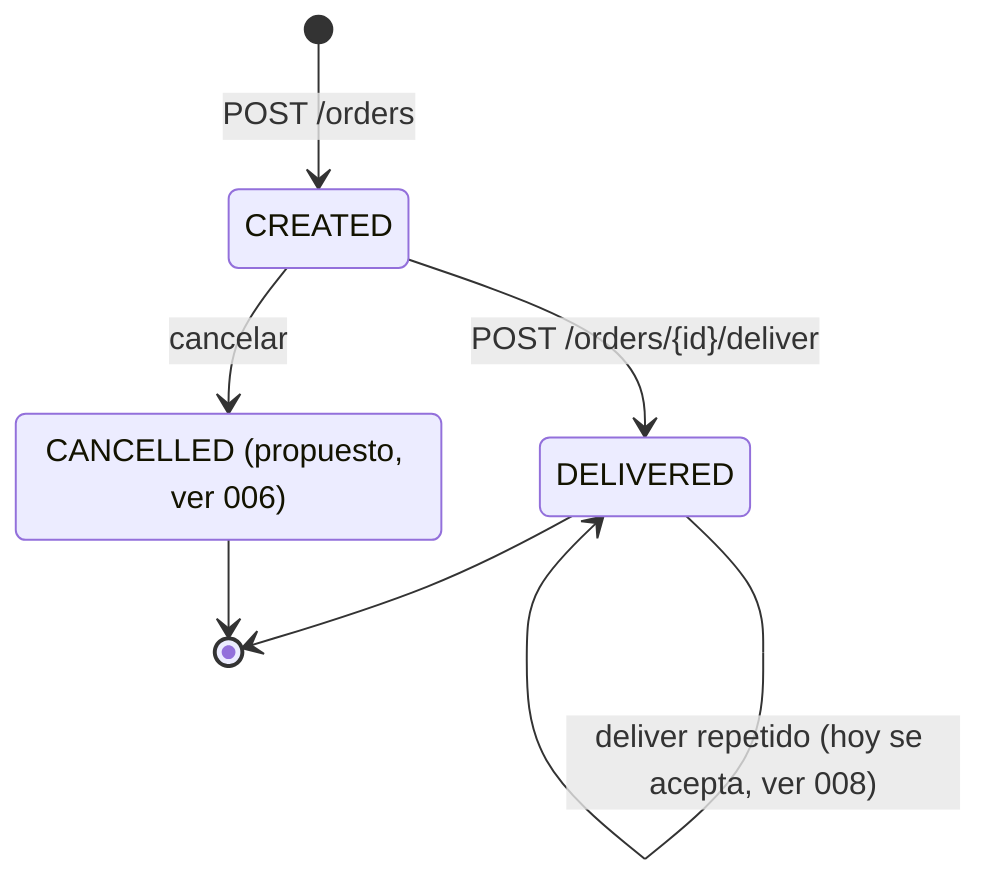

# 000 · Ciclo de vida del pedido (estados)

- **Estado:** Implementado
- **Servicio:** order-svc
- **Requisitos de sistema:** RS-11

## Historia de usuario

Como equipo, queremos una única definición de los estados de un pedido y de qué los hace cambiar, para que todos los servicios (y el worker) interpreten igual el campo `status`.

## Requisitos funcionales

- **RF-1** `order-svc` es el dueño del estado del pedido: ningún otro servicio lo modifica, solo lo consume a través de los eventos.
- **RF-2** Un pedido nace en `CREATED` y pasa a `DELIVERED` cuando se informa la entrega.
- **RF-3** Cada cambio de estado publica el evento correspondiente (`order.created`, `order.delivered`).
- **RF-4** Hoy **no se valida** la transición: se puede entregar dos veces el mismo pedido (ver 008).

## Escenarios de aceptación

1. **Dado** un pedido recién creado, **cuando** se lo consulta, **entonces** su `status` es `CREATED` y `actualMinutes` es nulo.
2. **Dado** un pedido `CREATED`, **cuando** se informa la entrega, **entonces** pasa a `DELIVERED` con `actualMinutes` completo.

## Diagrama de estados

## Transiciones

| Desde | Acción | Hacia | Efectos | Evento |
|---|---|---|---|---|
| (nuevo) | `POST /orders` | `CREATED` | guarda el pedido, ETA y repartidor asignados | `order.created` |
| `CREATED` | `POST /orders/{id}/deliver` | `DELIVERED` | guarda `actualMinutes`, libera al repartidor | `order.delivered` |
| `CREATED` | cancelar *(propuesto)* | `CANCELLED` | libera al repartidor | `order.cancelled` |

## Fuera de alcance / notas

- El diagrama vive acá porque `order-svc` es el dueño de la entidad. La vista entre servicios (quién reacciona a cada evento) está en [`docs/requirements.md` de ahk-delivery-infra](https://github.com/ezequieljsosa/ahk-delivery-infra/blob/main/docs/requirements.md).
